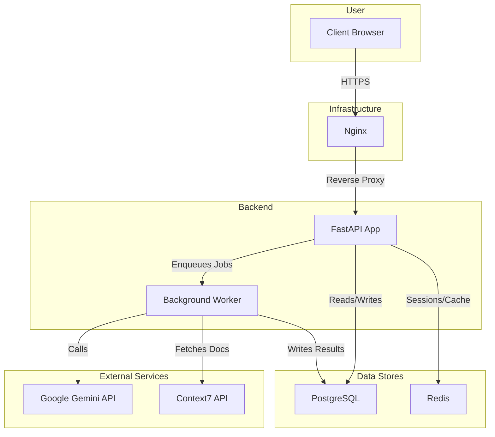
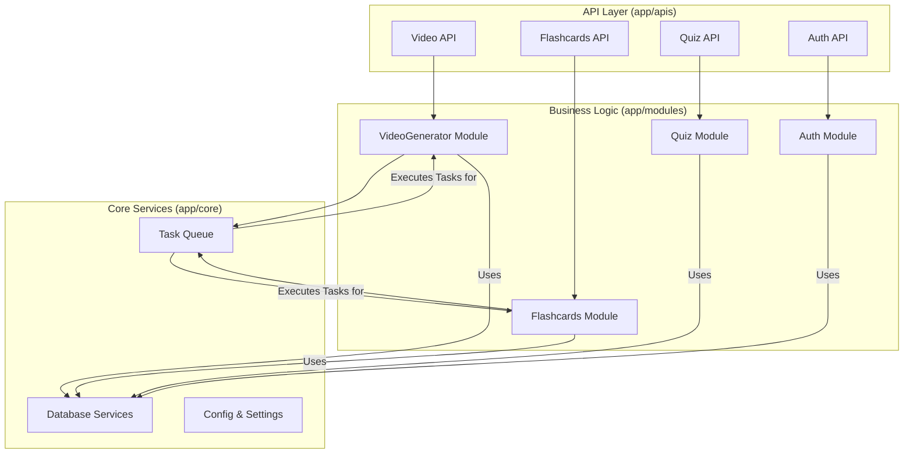
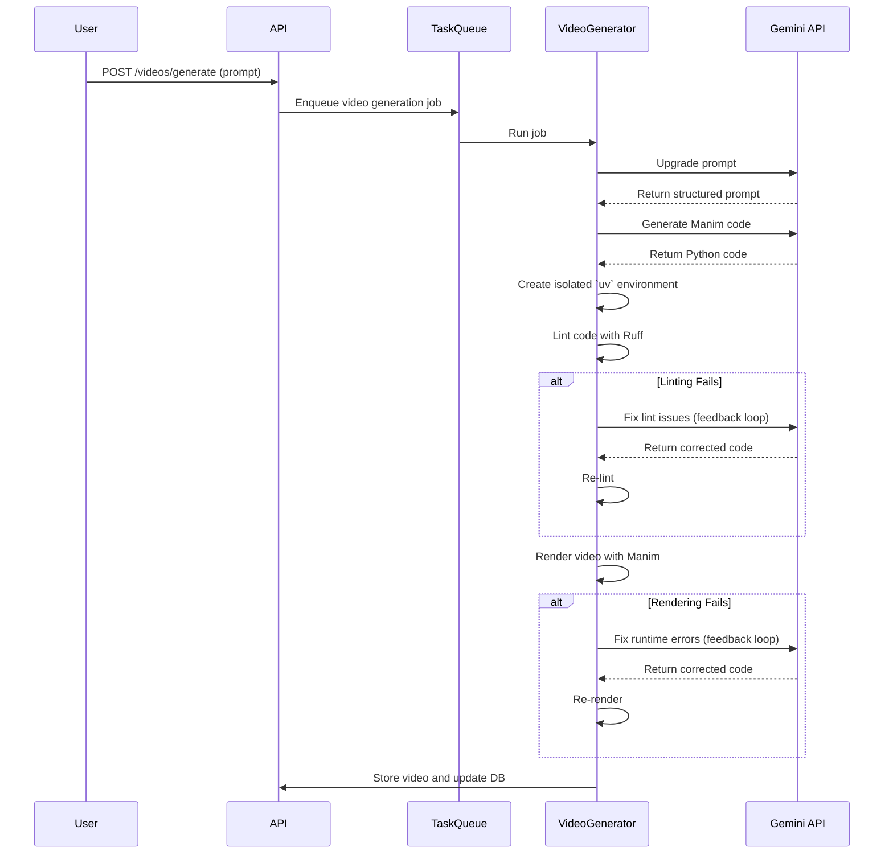
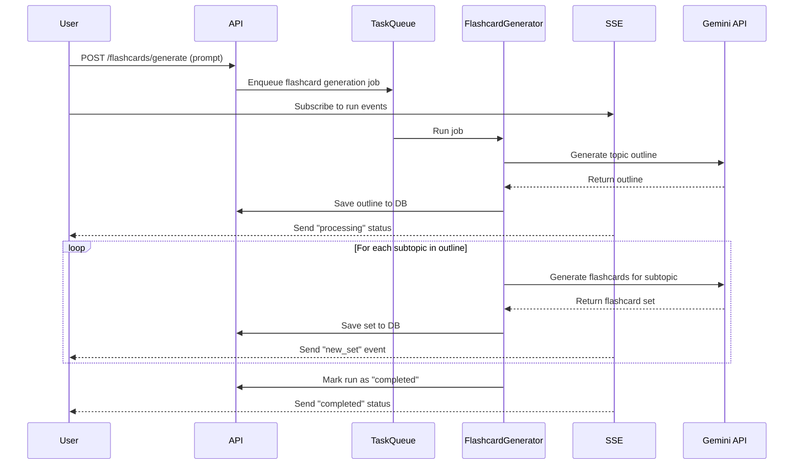
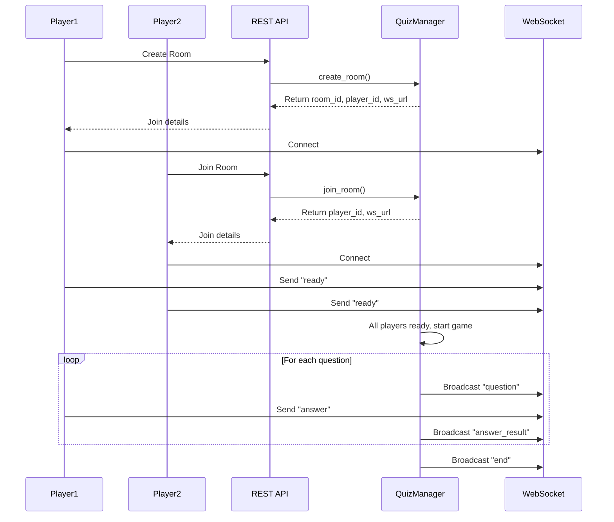

# Learn-KuchBhi

## Table of Contents

- [Inspiration](#inspiration)
- [Hosted Demo](#hosted-demo)
- [Features](#features)
- [Architecture](#architecture)
  - [System Overview](#system-overview)
  - [Module Architecture](#module-architecture)
- [How It Works](#how-it-works)
  - [Video Generation Pipeline](#video-generation-pipeline)
  - [Flashcard Generation Flow](#flashcard-generation-flow)
  - [Real-time Quiz](#real-time-quiz)
- [Technology Stack](#technology-stack)
- [Setup and Installation](#setup-and-installation)
  - [1. Prerequisites](#1-prerequisites)
  - [2. Clone the Repository](#2-clone-the-repository)
  - [3. Environment Variables](#3-environment-variables)
  - [4. Start Databases](#4-start-databases)
  - [5. Install Dependencies](#5-install-dependencies)
  - [6. Run Database Migrations](#6-run-database-migrations)
  - [7. Run the Application](#7-run-the-application)
- [What's next for Learn-KuchBhi](#whats-next-for-learn-kuchbhi)

## Inspiration

We learn best when concepts are explained visually and reinforced through practice. We wanted a way to turn any topic into bite-sized study assets like animated explanations, organized flashcards, and a quick multiplayer quiz, so that students can go from curiosity to understanding in minutes.

## Hosted Demo

A live version of the platform is hosted at **[https://kuch-bhi.built.systems](https://kuch-bhi.built.systems)**.

You can log in and explore the features using the following credentials:
- **Email**: `main@built.systems`
- **Password**: `main@built.systems`

To see already generated content, navigate to the `My Topics` and `My Videos` sections after logging in.

## Features

## Demo

Here is a short demonstration of the AI-powered video generation feature, creating a visual proof of the Pythagorean Theorem from a simple prompt.

https://github.com/user-attachments/assets/059f4df6-7922-40a9-9807-f4ba877fd4c3

*   **AI-Powered Video Generation**: Turns a simple text prompt into a fully rendered Manim educational animation. The system automatically upgrades the prompt, generates and lint-fixes Python code, and renders an MP4 video that can be streamed instantly.
*   **Smart Flashcard Generation**: Creates comprehensive study sets from a topic. It first designs a hierarchical outline (topics and subtopics) and then generates high-quality flashcards for each subtopic, streaming live progress via Server-Sent Events (SSE).
*   **Real-time Multiplayer Quiz**: A fast-paced multiple-choice quiz that can be played solo or with a friend. Questions can be generated by an AI for any topic or in a "Math Mode". The entire gameplay is powered by WebSockets for low-latency interaction and score updates.
*   **User Accounts & Persistence**: Provides secure user authentication and stores all generated videos, flashcards, and topics in a PostgreSQL database, making them accessible for later review.

## Architecture

### System Overview

The application is a FastAPI backend that serves a REST API, WebSocket endpoints for the quiz, and Server-Sent Events for live updates. It relies on external services like Google Gemini for AI capabilities and a PostgreSQL database for persistence.



### Module Architecture

The backend is organized into three main layers: `apis`, `modules`, and `core`.

-   `app/apis`: Contains the FastAPI routers that define the HTTP and WebSocket endpoints. This is the entry point for all external requests.
-   `app/modules`: Implements the core business logic for each feature (video generation, flashcards, quiz, auth). This layer is responsible for orchestrating the generation processes.
-   `app/core`: Provides shared services and configuration, including database connections, background task queueing, and settings management.



## How It Works

### Video Generation Pipeline

The video pipeline is an agentic system that turns a prompt into a finished MP4 file through a series of automated steps involving code generation, linting, and self-correction.



### Flashcard Generation Flow

Flashcard generation is a multi-step process that first creates a structured outline and then generates flashcards for each part of that outline.



### Real-time Quiz

The quiz uses a combination of REST endpoints for room management and WebSockets for real-time gameplay.



## Technology Stack

*   **Backend**: Python, FastAPI, Uvicorn
*   **AI & Code Generation**: `pydantic-ai`, Google Gemini (`google-genai`)
*   **Video**: Manim, MoviePy
*   **Database**: PostgreSQL with SQLAlchemy and `asyncpg`
*   **Migrations**: Alembic
*   **Authentication**: `fastapi-users` with JWT (`jwcrypto`/`pyjwt`)
*   **Real-time**: Server-Sent Events (SSE), WebSockets
*   **Caching/Sessions**: Redis
*   **Package Management**: `uv`
*   **Containerization**: Docker, Docker Compose
*   **Reverse Proxy**: Nginx (for TLS, SSE/WS proxying)
*   **Docs for AI**: Context7 API integration for fetching real-time documentation.

## Setup and Installation

### 1. Prerequisites

-   **Python 3.11+**
-   **`uv`**: The project uses `uv` for package management. Install it by following the official instructions: [https://docs.astral.sh/uv/getting-started/installation/](https://docs.astral.sh/uv/getting-started/installation/)
-   **Docker** and **Docker Compose**: For running local database instances.
-   **Manim System Dependencies**: FFmpeg, Cairo, Pango, etc. Follow the [Manim installation guide](https://docs.manim.community/en/stable/installation/uv.html) for your operating system.

### 2. Clone the Repository

```bash
git clone https://github.com/sasanktumpati/learn-kuch-bhi-back.git
cd learn-kuch-bhi-back
```

### 3. Environment Variables

Create a `.env` file in the project root by copying the example file:

```bash
cp .env.example .env
```

Now, edit the `.env` file and fill in the required values:

```env
APP_NAME=kuch-bhi
API_VERSION=v1
APP_PORT=9000

# App mode (can be dev or prod)
MODE=dev

# PostgreSQL Settings
POSTGRES_HOST=localhost
POSTGRES_DB_PORT=5432
POSTGRES_DB_NAME=kuchbhi_db
POSTGRES_DB_USER=kuchbhi_user
POSTGRES_DB_PASSWORD=your_strong_password

# Redis Settings
REDIS_HOST=localhost
REDIS_PORT=6379
# REDIS_PASSWORD=

# Application Settings
APP_NAME=learn-kuch-bhi
API_VERSION=v1
APP_PORT=9000
MODE=dev # dev or prod
JWT_SECRET=a_very_secret_and_long_random_string

# JWT Settings
JWT_ISSUER=learn-kuch-bhi
JWT_APPLICATION_ID=learn-kuch-bhi
JWT_TOKEN_LIFETIME_SECONDS=86400

# AI Provider Settings
MODEL_PROVIDER=google
GEMINI_API_KEY=your_google_gemini_api_key

# Optional: Context7 API for documentation fetching
CONTEXT7_ENABLED=true
CONTEXT7_API_KEY=your_context7_api_key
```

### 4. Start Databases

Run the local PostgreSQL and Redis instances using Docker Compose:

```bash
docker compose up -d
```

### 5. Install Dependencies

Install dependencies using `uv`:

```bash
uv sync
```

### 6. Run Database Migrations

Apply the database schema using Alembic:

```bash
uv run alembic upgrade head
```

### 7. Run the Application

Start the FastAPI server with Uvicorn:

```bash
uv run main.py
```

The API will be available at `http://localhost:9000`.

## What's next for Learn-KuchBhi

*   Rich frontend for creation, review, and study flows; shareable links and classrooms.
*   Editable timelines for videos and flashcard curation; export to Anki/CSV.
*   More quiz modes (buzz-in, timed rounds), leaderboards, and persistence.
*   Caching, deduplication, and reuse of assets; cost/latency optimizations.
*   More providers and guardrails; better observability and retry logic.
